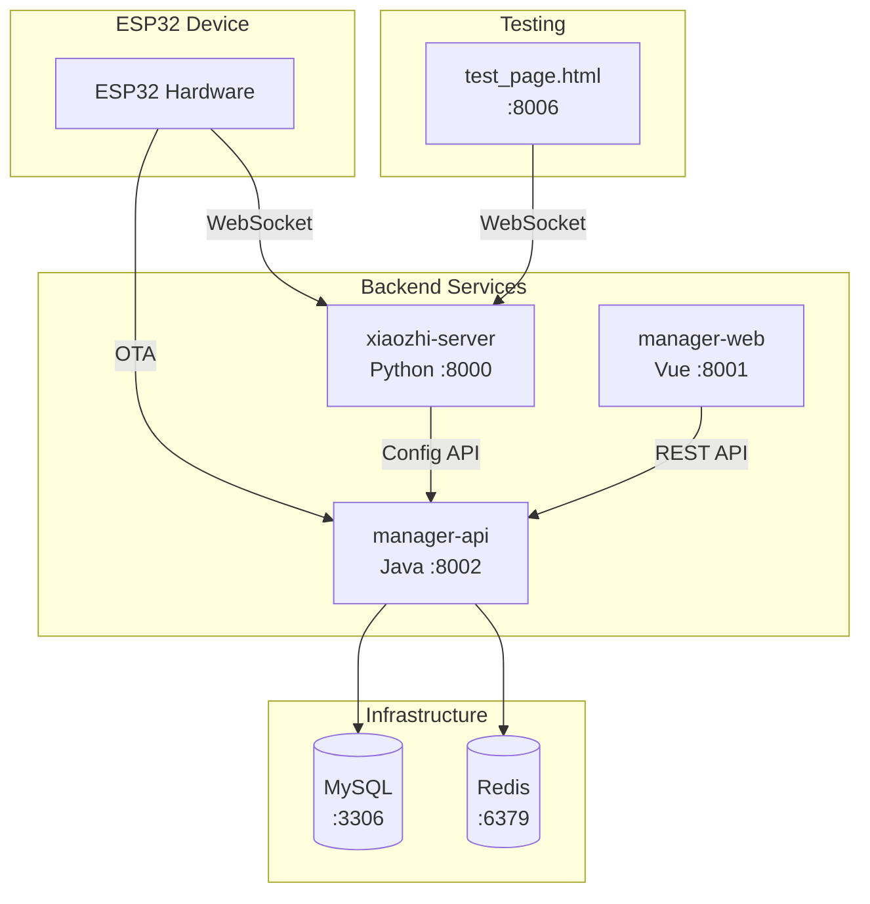

# 🚀 Xiaozhi ESP32 Server Deployment Guide

A comprehensive guide to deploy the complete Xiaozhi ESP32 Server platform, including:
- **xiaozhi-server** (Python) - Core WebSocket server for voice interaction
- **manager-api** (Java) - Backend API for management console
- **manager-web** (Vue) - Web management portal
- **test_page.html** - Browser-based testing tool

---

## 📋 Architecture Overview



---

## 📦 Prerequisites

### System Requirements

| Deployment Mode | CPU | RAM | Notes |
|----------------|-----|-----|-------|
| Using FunASR (local) | 4 cores | 8GB | Local speech recognition |
| All APIs (cloud) | 2 cores | 4GB | Cloud-based ASR/TTS |

### Software Dependencies

| Component | Requirement | Download |
|-----------|-------------|----------|
| **Python** | 3.10 (recommended) | [Anaconda](https://www.anaconda.com/download) |
| **Java** | JDK 21+ | [Oracle JDK](https://www.oracle.com/java/) or [OpenJDK](https://adoptium.net/) |
| **Maven** | 3.8+ | [Apache Maven](https://maven.apache.org/) |
| **Node.js** | 16+ (LTS) | [Node.js](https://nodejs.org/) |
| **MySQL** | 8.0+ | [MySQL](https://dev.mysql.com/downloads/) |
| **Redis** | 6.0+ | [Redis](https://redis.io/download) |

---

## 🗂️ Project Structure

```
xiaozhi-esp32-server/
├── main/
│   ├── xiaozhi-server/          # Python WebSocket server
│   │   ├── app.py               # Main entry point
│   │   ├── config.yaml          # Configuration file
│   │   ├── requirements.txt     # Python dependencies
│   │   ├── models/              # ASR models directory
│   │   └── test/                # Test page
│   │       └── test_page.html   # Browser testing tool
│   ├── manager-api/             # Java Spring Boot API
│   │   ├── pom.xml              # Maven dependencies
│   │   └── src/main/            
│   │       ├── java/            # Java source code
│   │       └── resources/       # Configuration files
│   └── manager-web/             # Vue.js web portal
│       ├── package.json         # npm dependencies
│       └── src/                 # Vue source code
└── docs/                        # Documentation
```

---

## 1️⃣ Database Setup

### Option A: Docker (Recommended)

```bash
# Create MySQL container
docker run --name xiaozhi-esp32-server-db \
  -e MYSQL_ROOT_PASSWORD=123456 \
  -e MYSQL_DATABASE=xiaozhi_esp32_server \
  -e MYSQL_INITDB_ARGS="--character-set-server=utf8mb4 --collation-server=utf8mb4_unicode_ci" \
  -e TZ=Asia/Shanghai \
  -p 3306:3306 \
  -d mysql:latest

# Create Redis container
docker run --name xiaozhi-esp32-server-redis \
  -p 6379:6379 \
  -d redis
```

### Option B: Manual Installation

1. Install MySQL 8.0+ and create database:

```sql
CREATE DATABASE xiaozhi_esp32_server 
  CHARACTER SET utf8mb4 
  COLLATE utf8mb4_unicode_ci;
```

2. Install Redis and ensure it's running on port 6379

---

## 2️⃣ Deploy manager-api (Java Backend)

The manager-api is a Spring Boot application that provides REST APIs for the management console.

### Step 1: Install JDK 21

```bash
# Verify Java installation
java -version
# Should show: openjdk version "21.x.x" or similar
```

### Step 2: Install Maven

```bash
# Verify Maven installation
mvn -v
# Should show: Apache Maven 3.x.x
```

### Step 3: Configure Database Connection

Edit `main/manager-api/src/main/resources/application-dev.yml`:

```yaml
spring:
  datasource:
    druid:
      driver-class-name: com.mysql.cj.jdbc.Driver
      url: jdbc:mysql://127.0.0.1:3306/xiaozhi_esp32_server?useUnicode=true&characterEncoding=UTF-8&serverTimezone=Asia/Shanghai&nullCatalogMeansCurrent=true
      username: root
      password: 123456  # Change to your password
  data:
    redis:
      host: 127.0.0.1
      port: 6379
      password:         # Add if Redis has password
      database: 0
```

### Step 4: Build and Run

```bash
cd main/manager-api

# Build the project
mvn clean package -DskipTests

# Run the application
java -jar target/xiaozhi-esp32-api.jar
```

Or run directly with Maven:

```bash
mvn spring-boot:run
```

### Verify Deployment

When you see this log, the API is running:

```
Started AdminApplication in X.XXX seconds
http://localhost:8002/xiaozhi/doc.html
```

**Access Points:**
- API Documentation: `http://localhost:8002/xiaozhi/doc.html`
- OTA Endpoint: `http://localhost:8002/xiaozhi/ota/`

> ⚠️ **Important**: Register the first user immediately! The first registered user becomes the super administrator.

---

## 3️⃣ Deploy manager-web (Vue Frontend)

The manager-web is a Vue.js application that provides the web management portal.

### Step 1: Install Node.js

```bash
# Verify Node.js installation
node -v
# Should show: v16.x.x or higher

npm -v
# Should show: 8.x.x or higher
```

### Step 2: Install Dependencies

```bash
cd main/manager-web

# Install npm packages
npm install
```

### Step 3: Configure API Endpoint (Optional)

If your manager-api is not running on `http://localhost:8002`, edit `.env.development`:

```properties
VUE_APP_API_BASE_URL=/xiaozhi
```

For production, you may need to configure a reverse proxy.

### Step 4: Start Development Server

```bash
npm run serve
```

### Verify Deployment

The web portal will be available at: `http://localhost:8001`

### Production Build (Optional)

```bash
# Build for production
npm run build

# The built files will be in the dist/ folder
```

---

## 4️⃣ Deploy xiaozhi-server (Python Server)

The xiaozhi-server is the core WebSocket server that handles voice interactions.

### Step 1: Create Conda Environment

```bash
# Remove existing environment (if any)
conda remove -n xiaozhi-esp32-server --all -y

# Create new environment with Python 3.10
conda create -n xiaozhi-esp32-server python=3.10 -y

# Activate environment
conda activate xiaozhi-esp32-server
```

### Step 2: Install System Dependencies

```bash
# Add Tsinghua mirror for faster downloads (China)
conda config --add channels https://mirrors.tuna.tsinghua.edu.cn/anaconda/pkgs/main
conda config --add channels https://mirrors.tuna.tsinghua.edu.cn/anaconda/pkgs/free
conda config --add channels https://mirrors.tuna.tsinghua.edu.cn/anaconda/cloud/conda-forge

# Install required system libraries
conda install libopus -y
conda install ffmpeg -y

# For Linux: Install libiconv if missing
# conda install libiconv -y
```

### Step 3: Install Python Dependencies

```bash
cd main/xiaozhi-server

# Set pip mirror (China)
pip config set global.index-url https://mirrors.aliyun.com/pypi/simple/

# Install requirements
pip install -r requirements.txt
```

### Step 4: Download ASR Model

The default ASR model is SenseVoiceSmall. Download it and place in the models directory:

**Download Options:**
- [ModelScope (China)](https://modelscope.cn/models/iic/SenseVoiceSmall/resolve/master/model.pt)
- [Baidu Pan](https://pan.baidu.com/share/init?surl=QlgM58FHhYv1tFnUT_A8Sg&pwd=qvna) - Code: `qvna`

```bash
# Create models directory
mkdir -p models/SenseVoiceSmall

# Place model.pt in the directory
# models/SenseVoiceSmall/model.pt
```

### Step 5: Configure Server

Create `data/.config.yaml` for your custom configuration:

```bash
mkdir -p data
cp config_from_api.yaml data/.config.yaml
```

Edit `data/.config.yaml`:

```yaml
manager-api:
  url: http://127.0.0.1:8002/xiaozhi
  secret: YOUR_SERVER_SECRET_HERE
```

> ⚠️ **Important**: Get the `server.secret` from the management console:
> 1. Login as super admin
> 2. Go to "参数管理" (Parameter Management)
> 3. Find `server.secret` and copy its value

### Step 6: Run the Server

```bash
conda activate xiaozhi-esp32-server
cd main/xiaozhi-server
python app.py
```

### Verify Deployment

When you see this log, the server is running:

```
Websocket地址是 ws://xxx.xx.xx.xx:8000/xiaozhi/v1/
=======上面的地址是websocket协议地址，请勿用浏览器访问=======
```

**Access Points:**
- WebSocket: `ws://localhost:8000/xiaozhi/v1/`
- HTTP API: `http://localhost:8003`

---

## 5️⃣ Deploy test_page.html (Testing Tool)

The test page provides a browser-based interface for testing the WebSocket server.

### Start HTTP Server

```bash
cd main/xiaozhi-server/test

# Start Python HTTP server
python -m http.server 8006
```

### Access Test Page

Open in **Google Chrome**: `http://localhost:8006/test_page.html`

### Configure Test Page

1. Click the **Settings (设置)** button
2. Configure:
   - **OTA服务器地址**: `http://127.0.0.1:8002/xiaozhi/ota/`
   - **Device MAC**: Any test device ID
3. Click **Dial (拨号)** to connect

> ⚠️ **Note**: Do not open test_page.html directly as a file. It must be served via HTTP server.

---

## 6️⃣ Post-Deployment Configuration

### Configure WebSocket and OTA URLs in Console

1. Login to management console as super admin
2. Go to "参数管理" (Parameter Management)
3. Set these parameters:

| Parameter | Value | Description |
|-----------|-------|-------------|
| `server.websocket` | `ws://YOUR_IP:8000/xiaozhi/v1/` | WebSocket endpoint |
| `server.ota` | `http://YOUR_IP:8002/xiaozhi/ota/` | OTA endpoint |

### Configure LLM API Key

1. Go to "模型配置" (Model Configuration)
2. Click "大语言模型" (LLM)
3. Select "智谱AI" (or your preferred provider)
4. Enter your API key

### Register Your Device

1. Register the first user (becomes super admin)
2. Bind your ESP32 device using its MAC address
3. Configure AI assistant settings

---

## 🔧 Quick Reference

### Service Ports

| Service | Port | URL |
|---------|------|-----|
| xiaozhi-server (WS) | 8000 | ws://localhost:8000/xiaozhi/v1/ |
| xiaozhi-server (HTTP) | 8003 | http://localhost:8003 |
| manager-api | 8002 | http://localhost:8002/xiaozhi |
| manager-web | 8001 | http://localhost:8001 |
| test_page | 8006 | http://localhost:8006/test_page.html |
| MySQL | 3306 | - |
| Redis | 6379 | - |

### Startup Order

1. **MySQL** and **Redis** (infrastructure)
2. **manager-api** (backend API)
3. **manager-web** (frontend portal)
4. **xiaozhi-server** (WebSocket server)
5. **test_page** (optional, for testing)

### Common Commands

```bash
# Start manager-api
cd main/manager-api && mvn spring-boot:run

# Start manager-web
cd main/manager-web && npm run serve

# Start xiaozhi-server
conda activate xiaozhi-esp32-server
cd main/xiaozhi-server && python app.py

# Start test page server
cd main/xiaozhi-server/test && python -m http.server 8006
```

---

## ❓ Troubleshooting

### manager-api fails to start
- Check MySQL connection settings in `application-dev.yml`
- Ensure MySQL database `xiaozhi_esp32_server` exists
- Verify Redis is running

### manager-web can't connect to API
- Check if manager-api is running on port 8002
- Verify proxy configuration in `vue.config.js`

### xiaozhi-server connection errors
- Ensure `server.secret` matches between console and `.config.yaml`
- Check if manager-api is accessible from xiaozhi-server

### test_page shows "file:// protocol" warning
- Start HTTP server: `python -m http.server 8006`
- Access via `http://localhost:8006/test_page.html`

### ASR (Speech Recognition) not working
- Verify `model.pt` is in `models/SenseVoiceSmall/`
- Check conda environment has `libopus` and `ffmpeg`

---

## 📚 Additional Resources

- [FAQ](./docs/FAQ.md)
- [Docker Deployment Guide](./docs/Deployment_all.md#方式一docker运行全模块)
- [MQTT Gateway Integration](./docs/mqtt-gateway-integration.md)
- [Home Assistant Integration](./docs/homeassistant-integration.md)
- [Voice Print Recognition](./docs/voiceprint-integration.md)

---

## 🎉 Success Checklist

- [ ] MySQL database created
- [ ] Redis running
- [ ] manager-api started (port 8002)
- [ ] First user registered (super admin)
- [ ] `server.secret` configured
- [ ] `server.websocket` and `server.ota` set
- [ ] LLM API key configured
- [ ] manager-web accessible (port 8001)
- [ ] xiaozhi-server started (port 8000)
- [ ] test_page working (port 8006)
- [ ] Device connected and responding
